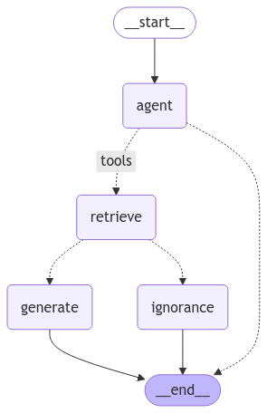

# Agentic RAG Chatbot 
This repository houses code for an Agentic RAG system, which conducts retrieval-augmented generation (RAG) on uploaded documents. It retrieves relevant documents from AstraDB and evaluates their relevance. If the retrieved documents are deemed relevant, the system generates an appropriate response to the user's request. Otherwise, it prompts the user for additional information.



## Install
1. Clone the Github repository:
```bash
git clone https://github.com/rsc1102/Agentic-RAG-Chatbot.git
```
2. Install the required dependencies:
```bash
pip install -r requirements.txt
```
3. Setup enviornment variables in the `.streamlit/secrets.toml`:
```toml
OPENAI_API_KEY="<openai-api-key>"
LANGCHAIN_TRACING_V2="true"
LANGCHAIN_PROJECT="<langchain-project-name>"
LANGCHAIN_API_KEY="<langchain-api-key>"

ASTRA_DB_COLLECTION_NAME="<astradb-collection-name>"
ASTRA_DB_API_ENDPOINT="<astradb-api-endpoint>"
ASTRA_DB_APPLICATION_TOKEN="<astradb-app-token>"
```

## Usage
1. Start the streamlit server: `streamlit run main.py`
2. Open url: `http://localhost:8501/`
3. For RAG upload the relevant documents.
4. Use the Chatbot.

## Directory Structure

```
Directory structure:
├── README.md
├── main.py               # Contains the main application code
├── graph.py              # Contains the langchain graph
├── document_handler.py   # Contains the document parser and vector store handler
├── requirements.txt
└── .streamlit
    ├── config.toml
    └── secrets.toml     
```

## Contributions
I’d greatly appreciate any feedback or contributions! Feel free to open a PR, and I’ll be happy to review it. 😊